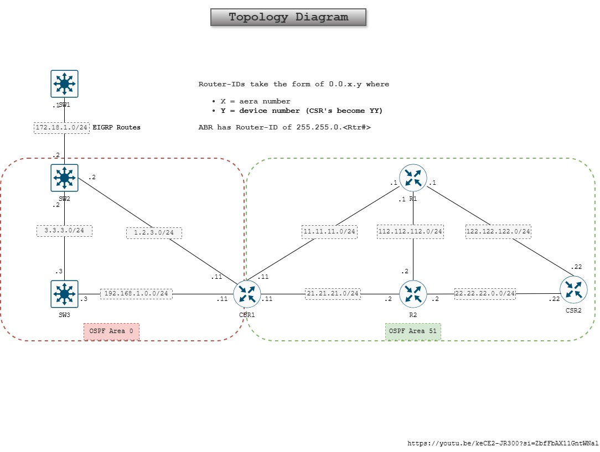

# Network Automation using Ansible for OSPF Configuration
This is the first network automation lab I have tried, this lab is part of learning routing protocol OSPF. OSPF stands for Open Shortest Path First is a link state routing protocol which runs on a Dijkstra algorith.

---

> _Disclaimer: Following lab is created on an emulation software and other virtual platforms. Some challenges may occur based of software, devices and method used to set up this lab.Candidate performing this lab should have dedication to spend time and follow documentation._

## Scope
Network automation enables us to configure network changes simultaneously on many network nodes instead manually applying changes on each device. Imagine, typing a new network statement on each network node by logging into each network node when there are more than 50 network nodes exist in a single OSPF area. Automation can push the configration within few minutes which saves time, resources, and human errors of misconfiguration doing a repetitive task.

While, automation saves time by applying mass changes to production network it is also important to have documented workflow (often called a change management process) to plan, test, rollback, implementation as well as review procedure. It is very much possible an improper change made by automation can be a disaster for whole production environment.

This lab shows how to configure network nodes in the OSPF area's using Ansible Playbooks and available modules within ansible library.

## Lab Topology

OSPF lab is designed following Keith Bogart YouTube video - Understanding Link State Advertisments. Topology has two OSPF area's. Area 0 (backbone area) and Area 51. There are four Cisco routers and three cisco switches are used. Router "CSR1" is a border gateway router for both area's and "Switch 2" is part of OSPF Area 0 and EIGRP network.




## Prerequisites

All network nodes require followings:

- Configure IPv4 addresses on interfaces connecting to each node.
- Setup remote management on all nodes using SSH (Secure Shell).
- Setup Linux virtual machine in eve-ng, connect it to CSR1.
- Configure CSR1  with ```ip route 0.0.0.0 0.0.0.0 <enter next hop ipv4 address```. In this case Linux virtual machine.
- Configure static route on each network node and ensure connectivity across all networks. 
- Configure static routes on the Linux virtual machine using CSR1 interface's IP.
- Verify network connectivity to each network node on lab using ping and SSH.

## Tools

- Emulation software like GNS3, Eve-ng or Cisco Modeling lab.
- Best case, Physical Cisco Switches, Routers, network cables, console cable and possibly more.
- Virtual machine either running in Emulation software or on a virtualization environment or a physical computer.

## Resources

Documentation from different sources were used to create this lab including using artificial intelligent. Once again candidate attempting this lab should be willing to spend time in troubleshooting and researching how different tools and software work together.

- [Proxmox](https://www.proxmox.com/en/)
- [Eve-ng](https://www.eve-ng.net/)
- [Ubuntu Server](https://documentation.ubuntu.com/server/)
- Cisco Switches and Routers virtual images
- [Draw.io](https://app.diagrams.net/)
- YouTube Video by [Keith Bogart](https://youtu.be/keCE2-JR300?si=O073NVqtQtAw_FNR)
- [Ansible-doc](https://docs.ansible.com/)
- Artificial Intelligent chat tools like Claude.io


