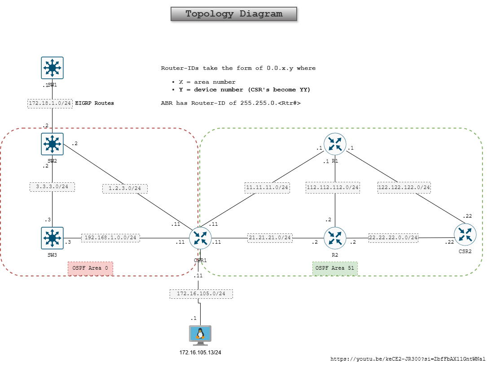

# Setting up lab
Part 2 of this lab is creating lab in the virtual environment. In this lab I have used EVE-NG platform.

## Creating a new lab
Start with creating a new lab in the eve-ng. Add 4 cisco routers and 3 cisco switches. Connect all network devices following the network design . Start all network nodes, verify all nodes can start.

An important plan, either a virtual linux server running on virtualization software is required or a Linux node from the eve-ng lab.

Linux machine will act as a controller to push ansible playbooks on the network devices.

## Basic configuration for all nodes

Basic configuration for all nodes to enable layer 3 connectivity and remote management. OSPF configuration should not be considered at this level, the goal is to have all network nodes to communicate to each other.

- Set hostnames on all routers and switches
- Set IPv4 Addresses on all interfaces connecting to their neighbouring devices
- Set ip domain name
- Set username and password
- Encrypt password on global level
- Setup SSHv2 on all devices.
- Configure static route configuration on all nodes.

## Configure linux virtual machine

Linux virtual machine hosted outside eve-ng lab needs to be connected using network "cloud0" as shown in the screenshot below. This method may require you do some research to connect the linux vm to the eve-ng environment. Check out [eve-ng documentation](https://www.eve-ng.net/wp-content/uploads/2025/04/EVE-CE-BOOK-6.3-2024.pdf) for details.

If linux machine is used from the eve-ng environment, a point-to-point link is needed.

## Conclusion

By the end of part two, you should have network connectivity from all network nodes to each other as well as linux virtual machine and from linux virtual machine to the network nodes.